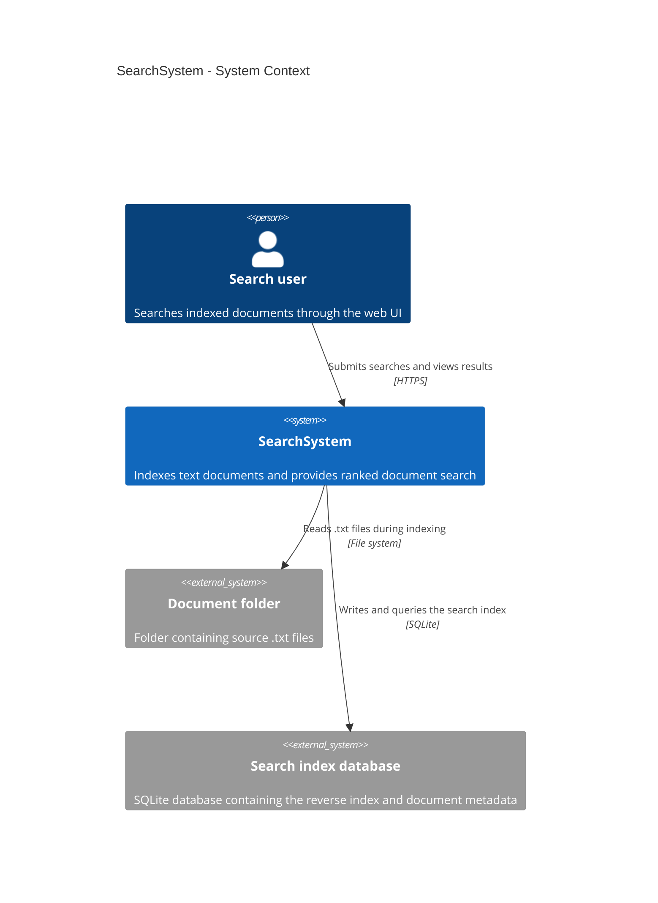
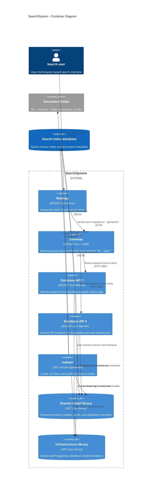

# SearchSystem Architecture

The diagrams below describe the current SearchSystem solution as it is started by
`Start-SearchSystem.ps1`.

## C4 Context

## C4 Containers

## Runtime Ports

| Container | Address | Role |
| --- | --- | --- |
| WebApp | `http://localhost:5002` | Browser-facing search UI |
| Gateway | `http://localhost:5000` | Reverse proxy |
| Database API 1 | `http://localhost:5081` | Search API instance |
| Database API 2 | `http://localhost:5082` | Search API instance |
